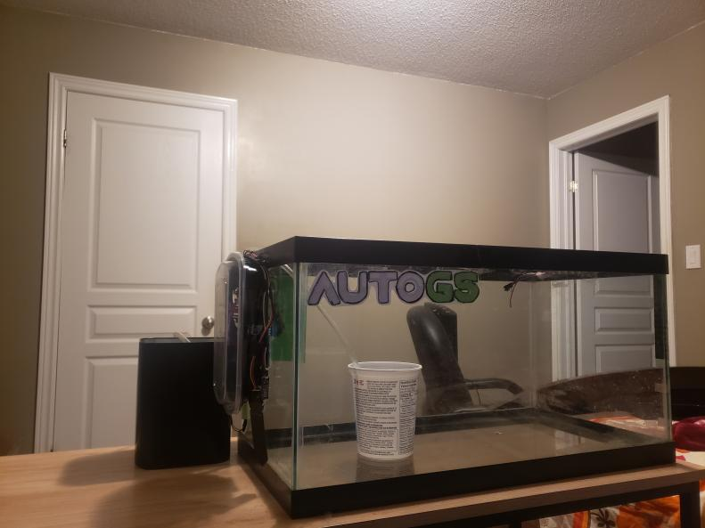
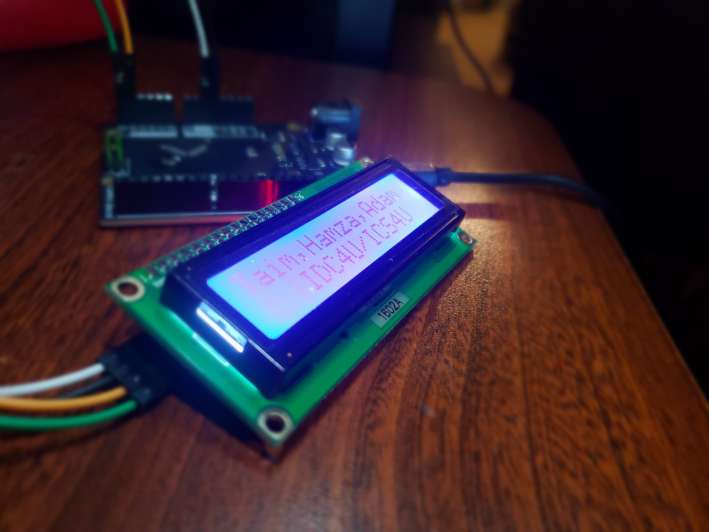

# AutoGS
## Automated Indoor Greenhouse Final Project for ICS4U

AutoGS is short for Automated Greenhouse System. It was created for the final project for our computer science course.
The purpose of AutoGS is to be able grow and maintain plants, just like a greenhouse except it is compact and kept inside.
AutoGS has features like watering, which can be done either automatically or manually. It also features LED lighting and 
sensors that include temperature, humidity, and moisture sensor. The automatic watering is done through the mositure
sensor, and manual watering is done through by typing a set number of seconds. The biggest aspect of AutoGS is that
it is all controlled on a website. There is no way to control the greenhouse physically!  

# Roles:
Taim Al-Dabbagh: Hardware, Firmware, Front-End Development  
Adam Ikram: Back-End Development  
Hamza Kamal: Budgeting and Financial Advisor

# Presentation

If you would like to see the presentation made for the project, click the link below!
https://docs.google.com/presentation/d/1Epsz7g38-xdMvVd-PFqC3vDY3L9fN5klvWrpnv8AvSQ/edit?usp=sharing
